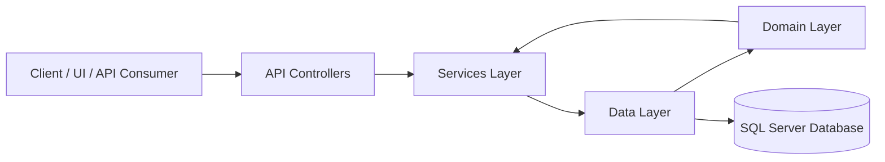
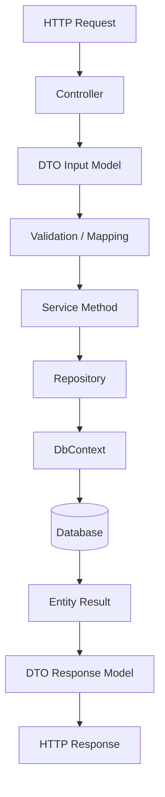
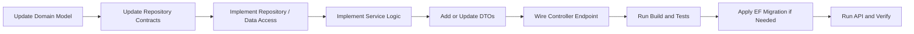
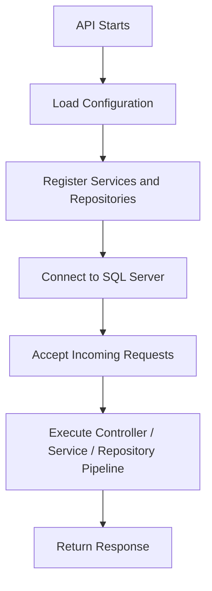

# ShiftMaster Project Folder Structure and Workflows

This document gives a quick map of the repository folders and shows the basic project workflows using flowcharts.

## Folder Structure

```text
shiftmaster/
├─ API/
│  ├─ Controllers/
│  ├─ Middlewares/
│  ├─ Properties/
│  ├─ Program.cs
│  ├─ appsettings.json
│  └─ API.http
├─ Services/
│  ├─ DTOs/
│  ├─ Implementation/
│  ├─ Interfaces/
│  └─ Mapper/
├─ Data/
│  ├─ Context/
│  ├─ Migrations/
│  └─ Repositories/
├─ Domain/
│  ├─ Enums/
│  ├─ models/
│  └─ Repositories/
├─ shiftmaster.slnx
├─ README.md
├─ API_CONTROLLERS_WORKFLOWS.md
└─ API_ENTITIES_DTOS_REPOSITORIES.md
```

### Folder Roles

| Folder | Purpose |
|---|---|
| `API/` | ASP.NET Core Web API host, controllers, middleware, and startup configuration. |
| `API/Controllers/` | HTTP endpoints for all business actions. |
| `API/Middlewares/` | Shared request-processing middleware components. |
| `API/Properties/` | Launch settings and project metadata. |
| `Services/` | Application services, DTOs, interfaces, and mapping profiles. |
| `Services/DTOs/` | Request and response models used by controllers and services. |
| `Services/Implementation/` | Service implementations and custom exceptions. |
| `Services/Interfaces/` | Service contracts consumed by the API layer. |
| `Services/Mapper/` | Mapping configuration for entity-to-DTO translation. |
| `Data/` | Entity Framework Core database context, migrations, and repositories. |
| `Data/Context/` | Database context and EF Core configuration. |
| `Data/Migrations/` | Database migration history. |
| `Data/Repositories/` | Data access implementations for entities and workflows. |
| `Domain/` | Core entities, enums, and repository contracts. |
| `Domain/Enums/` | Shared workflow and status enums. |
| `Domain/models/` | Entity models used by the data layer. |
| `Domain/Repositories/` | Repository interfaces and abstractions. |

## Layered Architecture Flow



### What Happens

1. A client sends an HTTP request to the API.
2. A controller receives the request and validates the payload.
3. The controller calls a service interface in `Services/Interfaces`.
4. The service applies business rules and uses repositories from `Data/Repositories`.
5. Repositories use `Data/Context/ApplicationDbContext` to read or write data.
6. Entities from `Domain/` are mapped to DTOs in `Services/DTOs`.
7. The API returns a response to the client.

## Basic Request Workflow



### Example Request Flow

- `POST /api/users/login` submits a `LoginDto`.
- The controller calls the authentication service.
- The service checks credentials through the repository layer.
- A token or error response is returned to the client.

## Development Workflow



### Recommended Build Order

1. Start with the domain model or enum change.
2. Update repository contracts and implementations.
3. Add or adjust service logic.
4. Add or update DTOs.
5. Wire the controller endpoint.
6. Build and test locally.
7. Apply migrations if the schema changed.

## Runtime Workflow



## Key Notes

- Keep dependencies flowing inward: `API -> Services -> Data -> Domain`.
- Use DTOs for request and response payloads instead of exposing entities directly.
- Keep business rules in services, not controllers.
- Keep database access inside repositories.
- Use migrations whenever the schema changes.